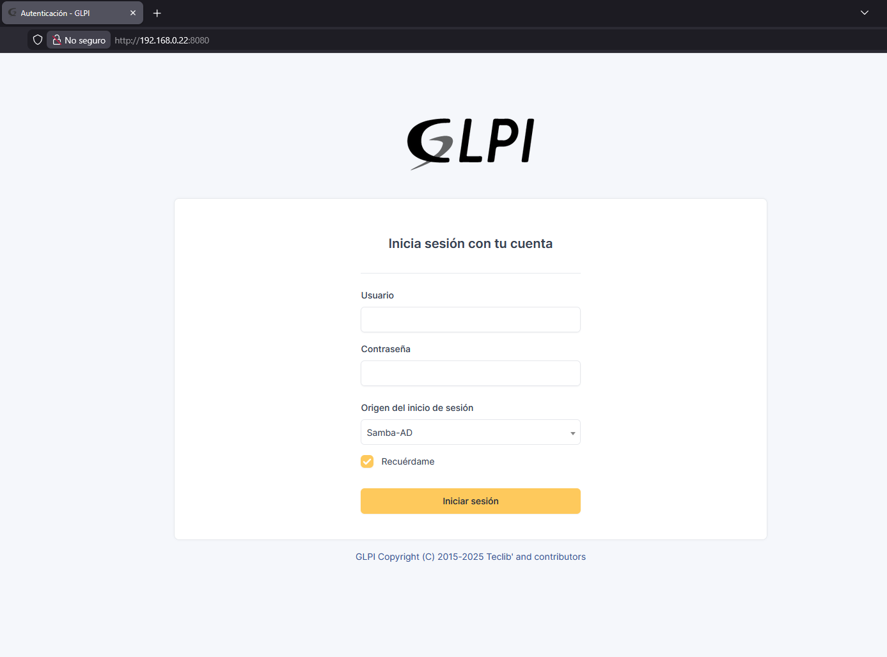
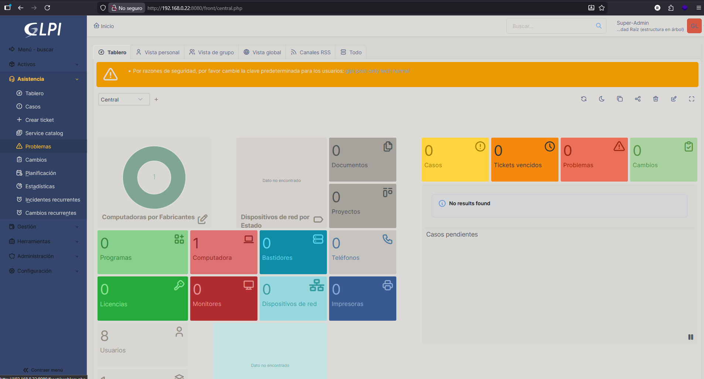
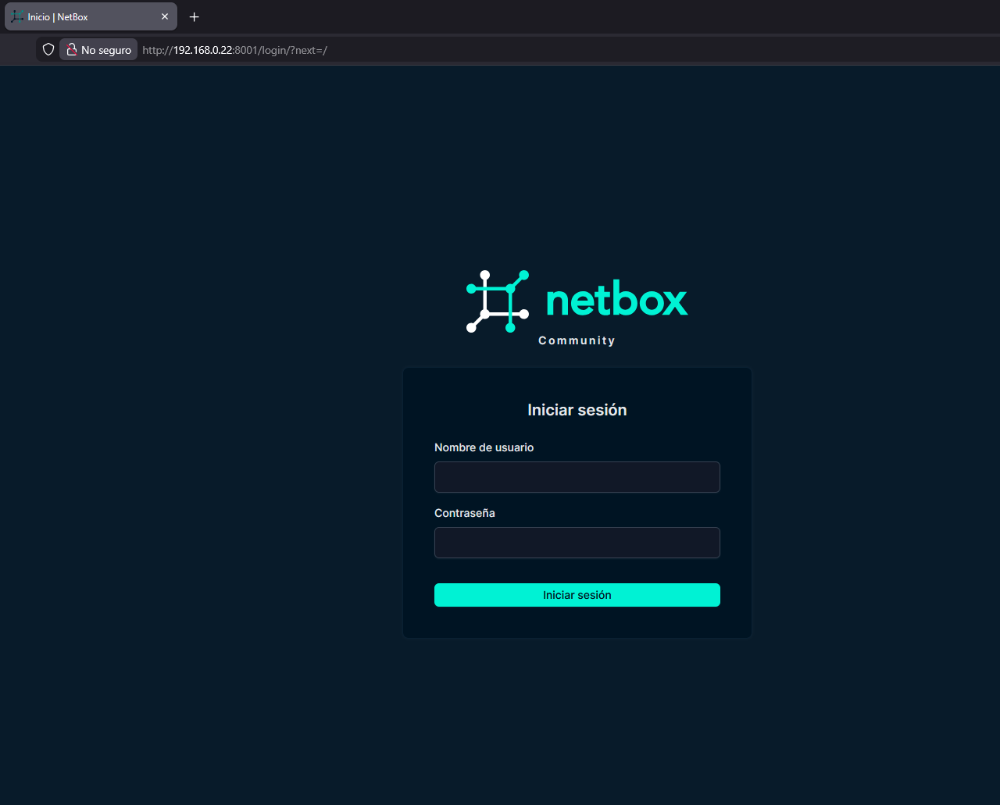
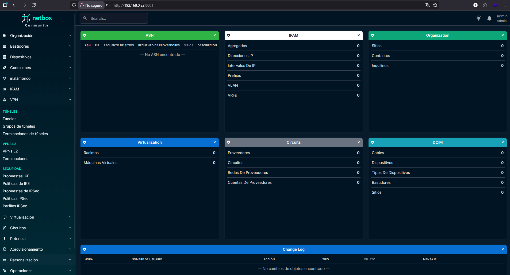
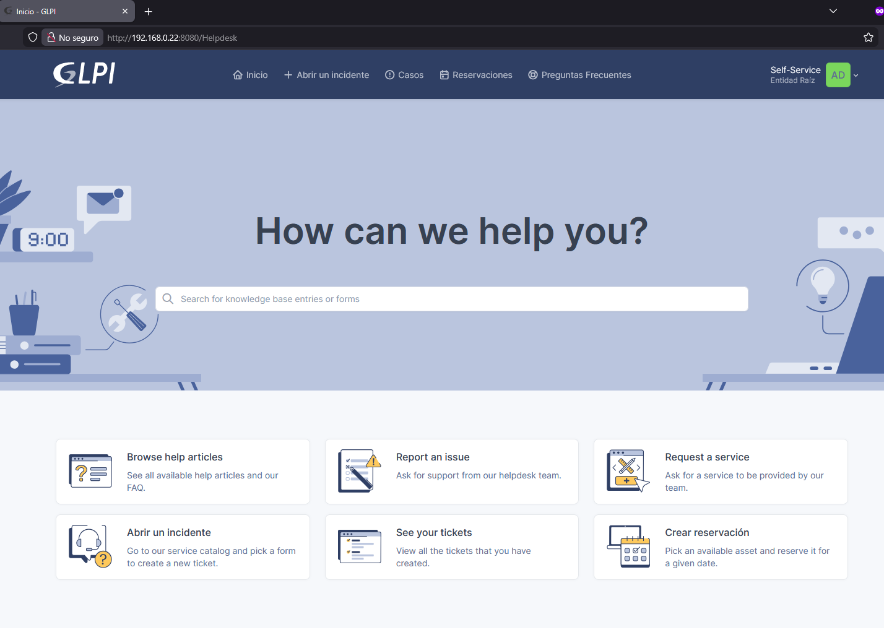
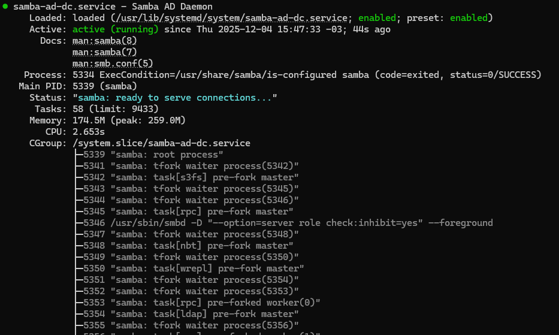

# itlab-stack
Infraestructura IT basada en Docker con GLPI, NetBox y Wazuh para gestión, monitoreo y seguridad en entornos productivos.

Este proyecto integra:

-  **GLPI** – Mesa de ayuda y gestión IT
-  **NetBox** – Gestión de red e inventario
-  **Wazuh** – SIEM / XDR
-  **Samba** – Servidor de archivos
-  **Docker + Docker Compose** – Orquestación

## 🎯 Objetivo del Proyecto

Crear una **plataforma unificada de infraestructura IT** reutilizable para:

- Laboratorios de ciberseguridad
- Soporte técnico empresarial
- Entornos de prueba SOC
- Freelance IT / MSP

---

## Arquitectura General

La arquitectura del proyecto está basada en un entorno de virtualización mediante contenedores Docker, orientado a simular la infraestructura IT de una pequeña empresa.

Los servicios principales funcionan de manera independiente pero integrada:

### 🖥️ GLPI > Gestión IT
GLPI se utiliza como sistema de mesa de ayuda (HelpDesk) y gestión de activos IT. Permite:
- Gestión de tickets de soporte
- Inventario de equipos
- Gestión de usuarios y técnicos
- Documentación interna

**GLPI está integrado con Samba para permitir la autenticación de usuarios desde la red local.**
#### GLPI Login

#### Dashboard - Metricas - Tickets

---

### 🌐 NetBox > Inventario de Red
NetBox se utiliza como sistema de documentación e inventario de infraestructura:
- Gestión de dispositivos de red
- Direccionamiento IP
- Racks, enlaces y topología
- Documentación centralizada

*NetBox actúa como referencia de la infraestructura para técnicos y administradores.*
#### Login

#### Dashboard de NetBox

---

### 🛡️ Wazuh > Seguridad y Monitoreo
Wazuh se utiliza como plataforma de seguridad:
- Monitoreo de logs
- Detección de intrusos
- Integridad de archivos
- Alertas de seguridad en tiempo real

*Permite supervisar tanto computadoras, servidores como los servicios desplegados en la red.*

---

## Integraciones del Proyecto

### GLPI + Samba

*GLPI está integrado con un servidor Samba para permitir:*

- Autenticación de usuarios desde red local  
- Asociación de técnicos y usuarios a recursos compartidos  
- Centralización de accesos  
- Gestión de archivos desde infraestructura interna

#### Panel de usuario

#### Estado del servicio

---

### Flujo General del Sistema

- Los usuarios trabajan con GLPI para soporte técnico.
- Los técnicos documentan infraestructura en NetBox.
- Wazuh monitorea continuamente eventos de seguridad.
- Samba centraliza la autenticación y los recursos compartidos.

---

## Requisitos

- Ubuntu Server 20.04+
- Docker
- Docker Compose
- 4 GB RAM mínimo (8 GB recomendado)
- 40 GB de disco mínimo

